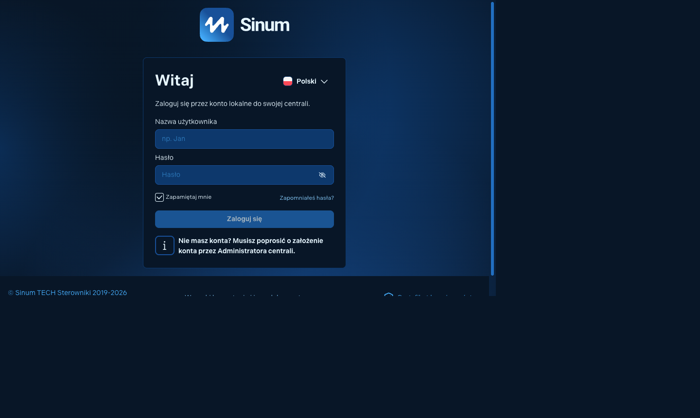
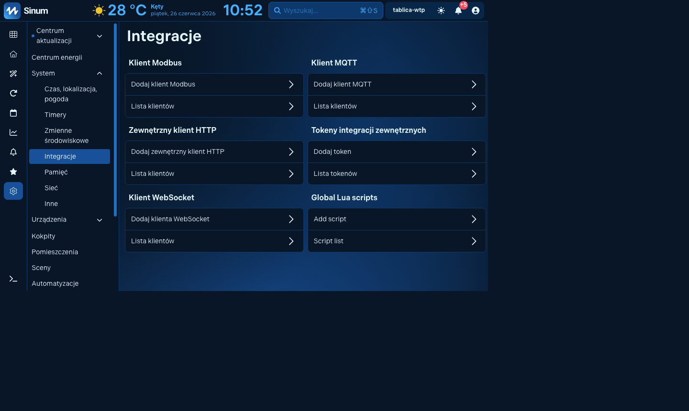
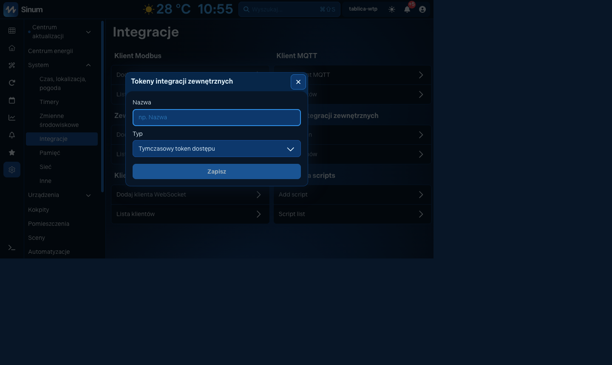
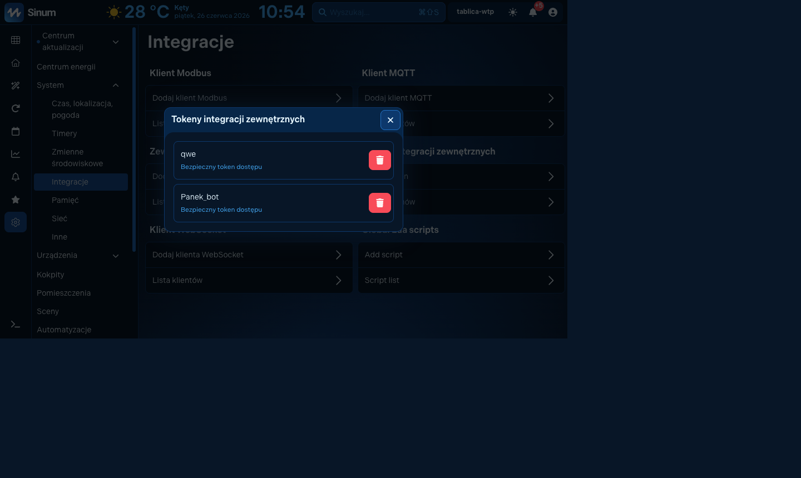
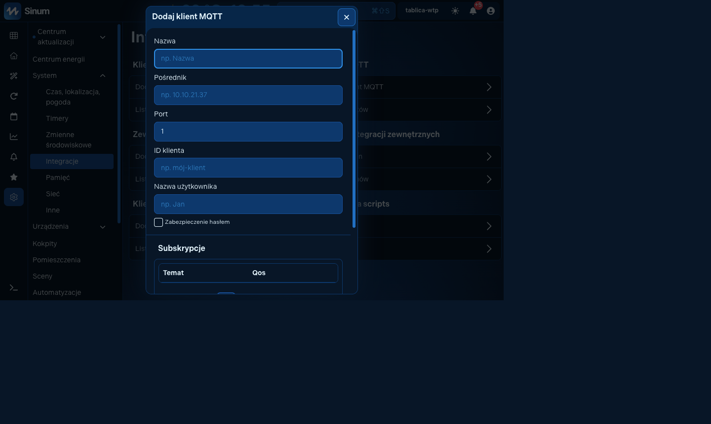

# Sinapse — integracja Sinum dla Home Assistant

**Sinapse** łączy centralę automatyki budynkowej TECH Sterowniki Sinum EH-01 z Home Assistant przez sieć lokalną. Integracja wykrywa urządzenia fizyczne i wirtualne z centrali Sinum, tworzy natywne encje Home Assistant i umożliwia odczyt oraz sterowanie.

**Język:** [English](README.md) | Polski

[](https://hacs.xyz)
[](https://www.home-assistant.io)
[](tests/)
[](custom_components/sinum/manifest.json)
[](LICENSE)

---

## Informacja prawna

- To nieoficjalny projekt społecznościowy. Nie jest powiązany z TECH Sterowniki, autoryzowany przez TECH Sterowniki ani utrzymywany przez producenta.
- Nazwy „TECH”, „Sinum” oraz powiązane oznaczenia mogą być znakami towarowymi ich właścicieli.
- Integracja korzysta z dostępnych API centrali do odczytu i sterowania urządzeniami we własnej instalacji użytkownika.
- Użytkownik odpowiada za zgodność użycia z prawem, regulaminami dostawcy oraz polityką bezpieczeństwa swojej sieci.
- Oprogramowanie jest dostarczane bez gwarancji. Szczegóły znajdują się w pliku [LICENSE](LICENSE).

---

## Spis treści

- [Jak to działa](#jak-to-działa)
- [Obsługiwane urządzenia](#obsługiwane-urządzenia)
- [Instalacja](#instalacja)
- [Dodanie Sinum do Home Assistant](#dodanie-sinum-do-home-assistant)
- [Konfiguracja](#konfiguracja)
- [Transport WebSocket](#transport-websocket)
- [Most MQTT](#most-mqtt)
- [Usługi Home Assistant](#usługi-home-assistant)
- [Sceny, automatyzacje i zmienne Sinum](#sceny-automatyzacje-i-zmienne-sinum)
- [Testowane centrale](#testowane-centrale)
- [Znane ograniczenia](#znane-ograniczenia)
- [Bezpieczeństwo](#bezpieczeństwo)
- [Wycofanie zmian](#wycofanie-zmian)
- [Licencja](#licencja)

---

## Jak to działa

```text
Centrala Sinum
    │
    │  REST API HTTP/JSON
    │  POST/PATCH /api/v1/devices/{bus}/{id}
    │
    ▼
SinumClient (api.py)
    │  asyncio + aiohttp, timeout 25 s
    │  token API albo login i JWT z automatycznym odświeżaniem
    │
    ▼
SinumCoordinator (coordinator.py)
    │  DataUpdateCoordinator
    │  cykliczny odczyt virtual, WTP, SBUS i LoRa
    │  stan z cache przy krótkiej niedostępności centrali
    │
    ├──► Platformy encji Home Assistant
    │    climate, sensor, switch, cover, light, event, button, number, update
    │
    ├──► WebSocket (zalecane)
    │    centrala wysyła zdarzenia zmian stanu
    │    integracja aktualizuje encje bez czekania na polling
    │
    └──► MQTT przez skrypt Lua (wariant awaryjny)
         skrypt w centrali publikuje zmiany stanu do brokera MQTT
```

Zalecana metoda logowania to **token API** utworzony w web UI Sinum. Dzięki temu Home Assistant nie przechowuje hasła użytkownika centrali.

---

## Obsługiwane urządzenia

### Platformy Home Assistant

| Platforma | Zakres |
|---|---|
| `climate` | Termostaty wirtualne, fan coile WTP/SBUS, regulatory temperatury, manager pompy ciepła |
| `sensor` | Temperatura, wilgotność, CO₂, ciśnienie, jakość powietrza, energia, moc, napięcie, prąd, pogoda, diagnostyka centrali, status automatyzacji |
| `binary_sensor` | Zalanie, ruch, otwarcie, dym, wejścia dwustanowe, łączność urządzeń nadrzędnych |
| `switch` | Przekaźniki wirtualne i fizyczne, elektrozaczep, zawory i pompy |
| `cover` | Bramy, rolety, integratory rolet |
| `light` | Ściemniacze, RGB, integratory dimmer/RGB |
| `event` | Zdarzenia przycisków fizycznych do automatyzacji HA |
| `button` | Sceny Sinum i skrypty Lua |
| `number` | Numeryczne zmienne środowiskowe Lua, wyjścia analogowe SBUS |
| `update` | Informacja o firmware urządzeń nadrzędnych |
| `alarm_control_panel` | System alarmowy, jeśli występuje w centrali |

### Magistrale i typy urządzeń

**Virtual:** `thermostat`, `relay_integrator`, `blind_controller_integrator`, `gate`, `wicket`, `dimmer_rgb_controller_integrator`, `heat_pump_manager`

**WTP:** czujniki temperatury, wilgotności, ciśnienia, światła, CO₂, IAQ, ruchu, zalania, otwarcia, dymu, wejścia dwustanowe, przekaźniki, dimmery, RGB, rolety, liczniki energii, fan coile, regulatory temperatury, przyciski

**SBUS:** czujniki temperatury, wilgotności, światła i ruchu, wejścia i wyjścia analogowe, liczniki impulsów, przekaźniki, dimmery, RGB, fan coile, regulatory, zawory, PWM, rolety, liczniki energii

**LoRa:** czujniki temperatury, wilgotności, otwarcia, zalania, dymu, przekaźniki i wejścia dwustanowe

---

## Instalacja

### HACS

1. Wejdź w **HACS → Integrations → ⋮ → Custom repositories**.
2. Dodaj repozytorium `https://github.com/zaba848/sinapse-sinum-integration-for-home-assistant`.
3. Wybierz kategorię **Integration**.
4. Zainstaluj **Sinum (Sinapse)**.
5. Zrestartuj Home Assistant.

### Instalacja ręczna

Skopiuj katalog integracji do konfiguracji Home Assistant:

```bash
cp -r custom_components/sinum /config/custom_components/
```

Następnie zrestartuj Home Assistant.

---

## Dodanie Sinum do Home Assistant

### Krok 1 — przygotuj token dostępu w centrali Sinum

Otwórz web UI centrali Sinum w tej samej sieci lokalnej co Home Assistant, na przykład `http://sinum.local` albo adres IP centrali.
To są tylko przykładowe adresy - użyj własnego hosta/IP swojej centrali w sieci lokalnej.



Po zalogowaniu przejdź do **Ustawienia → System → Integracje**. W angielskim UI jest to **Settings → System → Integrations**.



W sekcji **Tokeny integracji zewnętrznych**:

1. Kliknij **Dodaj token**.
2. Wpisz nazwę, na przykład `Home Assistant`.
3. Wybierz typ tokena.
4. Kliknij **Zapisz**.
5. Skopiuj wygenerowany token od razu i przechowuj go bezpiecznie.



Listę tokenów znajdziesz później w **Ustawienia → System → Integracje → Tokeny integracji zewnętrznych → Lista tokenów**.



Nie wklejaj tokena do zgłoszeń GitHub, logów, screenów ani wiadomości. Jeśli token zostanie utracony, utwórz nowy i usuń stary w web UI Sinum.

Szukasz oficjalnych materiałów TECH Sterowniki?
- Baza wiedzy Sinum: https://www.techsterowniki.pl/blog/kategoria/sinum
- FAQ: https://www.techsterowniki.pl/serwis/faq

### Krok 2 — dodaj integrację w Home Assistant

W Home Assistant przejdź do:

**Settings → Devices & Services → Add Integration → Sinum**

Kreator konfiguracji ma dwa etapy.

**Ekran 1 — adres centrali i metoda logowania**

| Pole | Co wpisać |
|---|---|
| Host | Adres IP lub nazwa hosta centrali, np. `10.0.62.167` (to tylko przykład). Bez `http://`. |
| Auth method | `api_token` zalecane albo `username_password` |

Jeśli nie znasz adresu IP centrali, spróbuj `sinum.local`. Jeśli to nie działa, sprawdź listę dzierżaw DHCP w routerze.

**Ekran 2 — dane dostępowe**

| Metoda | Co wpisać | Skąd wziąć |
|---|---|---|
| API Token | Token z Sinum | `Ustawienia → System → Integracje → Tokeny integracji zewnętrznych → Dodaj token` |
| Username / Password | Login i hasło Sinum | Dane używane do web UI Sinum |

Po kliknięciu **Submit** integracja pobierze urządzenia z centrali i utworzy encje.

### Krok 3 — włącz aktualizacje w czasie rzeczywistym

Bez WebSocket encje są odświeżane cyklicznie. Z WebSocket zmiany stanu pojawiają się zwykle poniżej jednej sekundy.

1. W Home Assistant przejdź do **Settings → Devices & Services → Sinum (Sinapse) → Configure**.
2. Włącz **Enable WebSocket real-time transport**.
3. Zostaw ścieżkę `/api/v1/ws`, jeśli centrala nie wymaga innej.
4. Kliknij **Submit**.

### Krok 4 — MQTT jako wariant awaryjny

Jeśli firmware centrali nie obsługuje WebSocket, można użyć mostu MQTT opartego o skrypt Lua. Szczegóły są w sekcji [Most MQTT](#most-mqtt).

---

## Konfiguracja

Opcje dostępne są z karty integracji przez **Configure**.

| Opcja | Domyślnie | Opis |
|---|---:|---|
| Scan interval | 30 s | Cykliczny odczyt REST. Zakres 10-300 s. Działa także jako ścieżka kontrolna przy WebSocket/MQTT. |
| Enable WebSocket real-time transport | wyłączone | Stałe połączenie WebSocket z centralą. Zalecane. |
| WebSocket endpoint path | `/api/v1/ws` | Zmieniaj tylko, jeśli dana wersja firmware używa innej ścieżki. |
| Enable MQTT real-time transport | wyłączone | Starszy wariant push przez Lua i MQTT. Używaj tylko, gdy WebSocket nie działa. |
| MQTT topic prefix | `sinum` | Musi być zgodny z `TOPIC_PREFIX` w skrypcie `mqtt_bridge.lua`. |

Jeśli token lub hasło zostanie zmienione, Home Assistant pokaże powiadomienie reautoryzacji. Kliknij **Re-authenticate** i podaj nowe dane.

---

## Transport WebSocket

WebSocket jest zalecaną metodą szybkich aktualizacji. Centrala wysyła zdarzenia zmian stanu, a integracja aktualizuje cache koordynatora bez czekania na kolejny polling REST.

Sprawdzenie działania:

1. Włącz WebSocket w opcjach integracji.
2. Zmień stan dowolnego urządzenia w Sinum.
3. Sprawdź, czy encja w Home Assistant aktualizuje się niemal natychmiast.
4. Jeśli nie, sprawdź logi Home Assistant dla `custom_components.sinum`.

---

## Most MQTT

MQTT jest wariantem awaryjnym dla firmware bez WebSocket.

### Dodanie klienta MQTT w centrali

W web UI Sinum przejdź do:

**Ustawienia → System → Integracje → Klient MQTT → Dodaj klient MQTT**

W angielskim UI:

**Settings → System → Integrations → MQTT client → Add MQTT client**



Ustaw adres brokera MQTT na adres Home Assistant, port zwykle `1883`, dane logowania i zapamiętaj identyfikator klienta.

### Wgranie mostu Lua

Użyj usługi Home Assistant:

```yaml
service: sinum.upload_mqtt_bridge
data:
  mqtt_scene_id: 1
  mqtt_client_id: 1
```

`mqtt_scene_id` to ID sceny Lua w centrali, która ma zostać nadpisana skryptem mostu. `mqtt_client_id` to numer klienta MQTT utworzonego w Sinum.

### Włączenie MQTT w integracji

1. Wejdź w **Settings → Devices & Services → Sinum (Sinapse) → Configure**.
2. Włącz **MQTT real-time transport**.
3. Ustaw `Topic prefix` zgodnie z konfiguracją skryptu Lua, domyślnie `sinum`.

---

## Usługi Home Assistant

### `sinum.send_notification`

Wysyła powiadomienie push przez centralę Sinum do aplikacji mobilnej.

```yaml
service: sinum.send_notification
data:
  title: "Alarm"
  message: "Wykryto zalanie w kotłowni"
```

### `sinum.update_schedule`

Aktualizuje harmonogram termiczny Sinum przez API centrali.

```yaml
service: sinum.update_schedule
data:
  schedule_id: 2
  payload:
    name: "Tryb komfortowy"
```

### `sinum.upload_mqtt_bridge`

Wgrywa skrypt Lua mostu MQTT do wskazanej sceny w centrali.

---

## Sceny, automatyzacje i zmienne Sinum

Sceny Sinum typu Lua są widoczne w Home Assistant jako encje `button`. Kliknięcie przycisku uruchamia scenę w centrali.

Numeryczne zmienne środowiskowe Lua są widoczne jako encje `number`, dzięki czemu automatyzacje Home Assistant mogą ustawiać wartości odczytywane później przez skrypty w Sinum.

Przykład automatyzacji Home Assistant:

```yaml
alias: Zamknij rolety o 22
trigger:
  - platform: time
    at: "22:00:00"
action:
  - service: cover.close_cover
    target:
      entity_id: cover.salon_rolety
```

---

## Testowane centrale

Projekt jest walidowany na żywych centralach WTP i SBUS. Aktualny plan testów oraz notatki walidacyjne znajdują się w [HARDWARE_TEST_PLAN.md](HARDWARE_TEST_PLAN.md).

Przed wydaniem wersji wykonywane są testy jednostkowe, walidacja integracji oraz smoke testy sprzętowe na centralach.

---

## Znane ograniczenia

- Część funkcji zależy od wersji firmware centrali Sinum.
- WebSocket może nie być dostępny w starszych wersjach firmware.
- MQTT wymaga poprawnie skonfigurowanego klienta MQTT w centrali oraz brokera w Home Assistant.
- Niektóre urządzenia wirtualne mogą nie raportować pełnego feedbacku pozycji lub stanu.
- Operacje zapisu zależą od tego, czy dana magistrala i urządzenie akceptują komendę w API Sinum.

---

## Bezpieczeństwo

- Nie wystawiaj centrali Sinum bezpośrednio do internetu.
- Najlepiej trzymaj Home Assistant i centralę Sinum w tej samej zaufanej sieci lokalnej lub VLAN.
- Używaj tokena API zamiast hasła, jeśli to możliwe.
- Nie publikuj tokena w logach, screenach ani zgłoszeniach.
- Jeśli token wycieknie, usuń go w web UI Sinum i utwórz nowy.
- Przy dostępie zdalnym używaj VPN albo bezpiecznego tunelu, nie przekierowania portów centrali.

---

## Wycofanie zmian

Jeśli po aktualizacji integracja działa niepoprawnie:

1. Wyłącz integrację Sinum w Home Assistant.
2. W HACS wróć do poprzedniej wersji albo przy instalacji ręcznej przywróć poprzedni katalog `custom_components/sinum`.
3. Zrestartuj Home Assistant.
4. Jeśli problem dotyczy tokena, utwórz nowy token w web UI Sinum i wykonaj reautoryzację integracji.

---

## Licencja

Kod jest udostępniony zgodnie z [LICENSE](LICENSE). Integracja jest projektem nieoficjalnym i nie jest produktem TECH Sterowniki.
