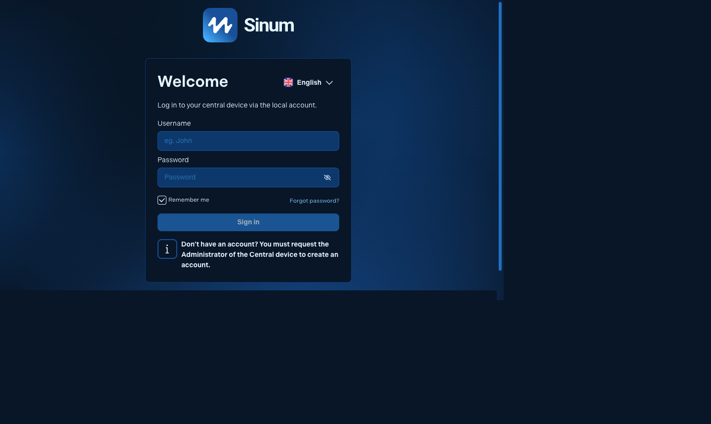
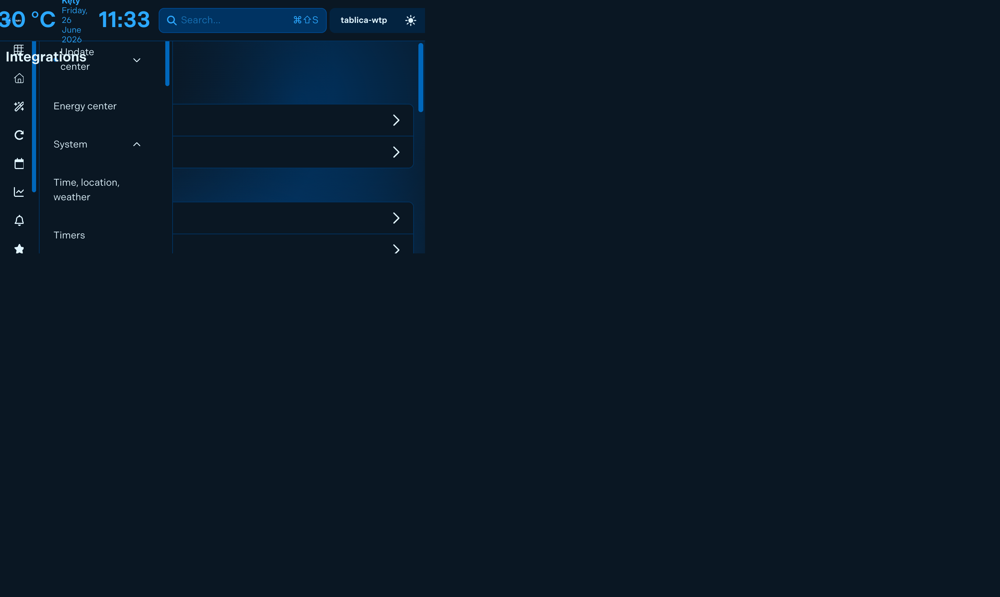
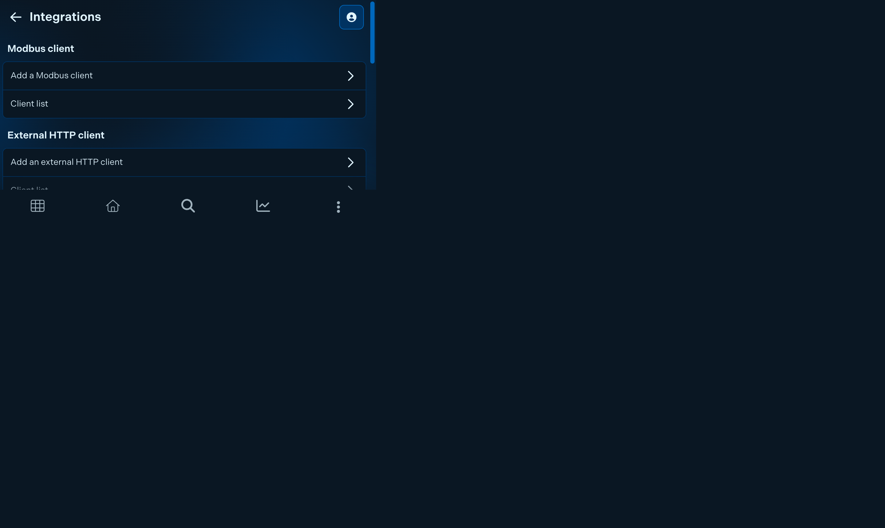

# Przewodnik instalacji — Sinapse / Sinum Integration

**[← Powrót do README](../README.pl.md)** · [English](installation.md)

---

## Spis treści

- [Wymagania](#wymagania)
- [Instalacja przez HACS (zalecana)](#instalacja-przez-hacs-zalecana)
- [Instalacja ręczna](#instalacja-ręczna)
- [Krok 1 — Tworzenie tokena API w centrali](#krok-1--tworzenie-tokena-api-w-centrali)
- [Krok 2 — Dodanie integracji w Home Assistant](#krok-2--dodanie-integracji-w-home-assistant)
- [Krok 3 — Włączenie aktualizacji w czasie rzeczywistym](#krok-3--włączenie-aktualizacji-w-czasie-rzeczywistym)
- [Krok 4 — Opcjonalnie: most MQTT jako wariant awaryjny](#krok-4--opcjonalnie-most-mqtt-jako-wariant-awaryjny)
- [Rozwiązywanie problemów](#rozwiązywanie-problemów)
- [Reautoryzacja](#reautoryzacja)
- [Rollback](#rollback)

---

## Wymagania

| Wymaganie | Minimum |
|---|---|
| Home Assistant | 2024.1 |
| Python | 3.12 (dołączony do HA) |
| Firmware centrali Sinum | dowolny (WebSocket wymaga obsługi `/api/v1/ws`) |
| Sieć | centrala dostępna z HA w sieci lokalnej |
| HACS | 1.x (opcjonalnie, przy instalacji przez HACS) |

> Integracja komunikuje się z centralą przez HTTP w sieci lokalnej. Zalecenia bezpieczeństwa — patrz [Bezpieczeństwo](../README.pl.md#bezpieczeństwo).

---

## Instalacja przez HACS (zalecana)

HACS to Home Assistant Community Store — zarządza instalacją i aktualizacjami automatycznie.

1. Otwórz HACS w menu bocznym HA.
2. Kliknij **Integrations** → menu **⋮** (prawy górny róg) → **Custom repositories**.
3. Dodaj URL: `https://github.com/zaba848/sinapse-sinum-integration-for-home-assistant`  
   Kategoria: **Integration**
4. Wyszukaj **Sinum** lub **Sinapse** i kliknij **Pobierz**.
5. Uruchom ponownie Home Assistant.

Po restarcie przejdź do [Kroku 1 — Tworzenie tokena API](#krok-1--tworzenie-tokena-api-w-centrali).

---

## Instalacja ręczna

Użyj tej metody, jeśli nie masz HACS lub wolisz bezpośrednią kontrolę.

```bash
# Z katalogu głównego repozytorium
cp -r custom_components/sinum /config/custom_components/
```

Możesz też pobrać najnowszy ZIP z GitHub Releases, rozpakować go i skopiować folder `sinum/` do `/config/custom_components/sinum/`.

Uruchom ponownie Home Assistant, a następnie przejdź do [Kroku 1](#krok-1--tworzenie-tokena-api-w-centrali).

---

## Krok 1 — Tworzenie tokena API w centrali

Integracja preferuje **statyczny token API** zamiast loginu i hasła. Token jest ograniczony zakresem, nie wygasa i można go odwołać niezależnie od hasła administratora.

Otwórz interfejs webowy Sinum w tej samej sieci lokalnej co Home Assistant. Adres to IP lub nazwa hosta centrali — np. `http://sinum.local` lub `http://sinum-hub.local` (użyj adresu swojej centrali, nie tego przykładu).



Po zalogowaniu przejdź do **Ustawienia → System → Integracje**.



W sekcji **Tokeny integracji zewnętrznych**:

1. Kliknij **Dodaj token**.
2. Wpisz opisową nazwę — np. `Home Assistant`.
3. Wybierz typ tokena.
4. Kliknij **Zapisz**.
5. **Skopiuj wygenerowany token natychmiast** — jest wyświetlany tylko raz.



Tokeny możesz przeglądać lub odwoływać później w **Ustawienia → System → Integracje → Tokeny integracji zewnętrznych → Lista tokenów**.


> **Bezpieczeństwo**: nie wklejaj tokena do zgłoszeń GitHub, logów, zrzutów ekranu ani wiadomości. Jeśli token wycieknie, utwórz nowy i odwołaj stary w interfejsie webowym Sinum.

**Oficjalne zasoby TECH Sterowniki:**
- Dokumentacja REST API: <https://apidocs.sinum.tech/>
- Podręcznik Lua: <https://www.techsterowniki.pl/!uploads/SINUM/LUA_user_manual.pdf>
- Baza wiedzy: <https://www.techsterowniki.pl/blog/kategoria/sinum>
- FAQ Sinum: <https://www.techsterowniki.pl/blog/system-sinum-najczesciej-zadawane-pytania>

---

## Krok 2 — Dodanie integracji w Home Assistant

Przejdź do: **Ustawienia → Urządzenia i usługi → Dodaj integrację → wyszukaj „Sinum"**

Kreator konfiguracji ma dwa ekrany.

### Ekran 1 — Adres centrali i metoda uwierzytelniania

| Pole | Co wpisać |
|---|---|
| **Host** | Adres IP lub nazwa hosta centrali — np. `sinum-hub.local`. Bez `http://`. |
| **Metoda uwierzytelniania** | `api_token` (zalecana) lub `username_password` |

> Jeśli nie znasz IP centrali, spróbuj `sinum.local`. Jeśli nie działa, sprawdź listę dzierżaw DHCP w routerze.

### Ekran 2 — Dane uwierzytelniające

| Metoda | Pole | Wartość |
|---|---|---|
| Token API | Token | Wklej token z Kroku 1 |
| Login / Hasło | Login | Twój login do interfejsu webowego Sinum |
| Login / Hasło | Hasło | Twoje hasło do interfejsu webowego Sinum |

Kliknij **Zatwierdź**. Home Assistant wykrywa wszystkie urządzenia i tworzy encje automatycznie. W dużych instalacjach może to chwilę potrwać.

---

## Krok 3 — Aktualizacje w czasie rzeczywistym (domyślnie włączone)

**Transport WebSocket jest domyślnie włączony** w wersji v0.6.0+. Stany encji aktualizują się teraz w czasie poniżej 1 sekundy zamiast co 30 sekund (odpytywanie REST).

### Weryfikacja, że WebSocket działa

1. W **Ustawienia → Urządzenia i usługi → Sinum (Sinapse) → Opcje**, potwierdź że **„Włącz transport WebSocket w czasie rzeczywistym"** jest ✅ zaznaczone.
2. Otwórz **Narzędzia deweloperskie → Zdarzenia → Nasłuchuj zdarzenia** i wpisz `sinum_device_state_changed`.
3. Wywołaj dowolną zmianę stanu w centrali (przełącz przekaźnik, otwórz drzwi).
4. Zdarzenie powinno pojawić się w czasie poniżej sekundy.

> Jeśli WebSocket nie działa lub widzisz częste rekonekty, sprawdź:
> - Wersję firmware centrali (musi obsługiwać `/api/v1/ws`)
> - Ważność tokena API
> - Stabilność sieci
>
> W razie potrzeby użyj [mostu MQTT](real-time.pl.md#mqtt-most-w-czasie-rzeczywistym-wariant-awaryjny).

---

## Krok 4 — Opcjonalnie: most MQTT jako wariant awaryjny

Pomiń ten krok, jeśli WebSocket działa. Użyj MQTT tylko gdy:
- Firmware centrali nie udostępnia `/api/v1/ws`
- Widzisz częste rekonekty WebSocket w logach

Pełny przewodnik konfiguracji MQTT: [Transport czasu rzeczywistego → MQTT](real-time.pl.md#mqtt-most-w-czasie-rzeczywistym-wariant-awaryjny).

---

## Rozwiązywanie problemów

### „Nie można połączyć z centralą"

| Przyczyna | Rozwiązanie |
|---|---|
| Błędny adres IP lub nazwa hosta | Sprawdź, czy centrala jest dostępna: `curl http://<ip-centrali>/api/v1/info` |
| Centrala na innym VLAN | Upewnij się, że HA i centrala są w tej samej sieci lub routing jest skonfigurowany |
| Firewall blokuje port 80 | Zezwól na TCP 80 z HA do centrali |

### „Nieprawidłowe dane uwierzytelniające" / „Nieautoryzowany"

| Przyczyna | Rozwiązanie |
|---|---|
| Błędnie wklejony token | Wygeneruj nowy i skopiuj ponownie z interfejsu webowego Sinum |
| Błędny login/hasło | Spróbuj zalogować się do interfejsu webowego Sinum tymi samymi danymi |
| Token odwołany | Utwórz nowy token w interfejsie webowym Sinum |

### Brak encji po konfiguracji

1. Sprawdź logi Home Assistant pod kątem błędów `custom_components.sinum`.
2. Tymczasowo włącz logowanie debug:
   ```yaml
   # configuration.yaml
   logger:
     logs:
       custom_components.sinum: debug
   ```
3. Przeładuj integrację i ponownie sprawdź logi.

### Encje pokazują „niedostępne"

Centrala jest tymczasowo nieosiągalna. Integracja serwuje stan z cache przez czas do interwału odpytywania (domyślnie 30 s). Sprawdź łączność z centralą i poczekaj na kolejne odpytywanie.

---

## Reautoryzacja

Jeśli token lub hasło ulegną zmianie, HA wyświetli powiadomienie. Kliknij **Reautoryzuj** i wpisz nowe dane. Restart nie jest potrzebny.

Integracja blokuje reautoryzację po 5 kolejnych nieudanych próbach na 5 minut, aby zapobiec atakom brute-force.

---

## Rollback

Jeśli aktualizacja spowoduje regresję:

1. Pobierz poprzedni ZIP z [GitHub Releases](https://github.com/zaba848/sinapse-sinum-integration-for-home-assistant/releases).
2. Zastąp `/config/custom_components/sinum/` starszą wersją.
3. Uruchom ponownie Home Assistant.
4. Sprawdź dostępność encji i automatyzacji.
5. [Zgłoś problem](https://github.com/zaba848/sinapse-sinum-integration-for-home-assistant/issues) z logami i parą wersji.

W środowiskach produkcyjnych przechowuj archiwa poprzednich dwóch wersji ZIP.
